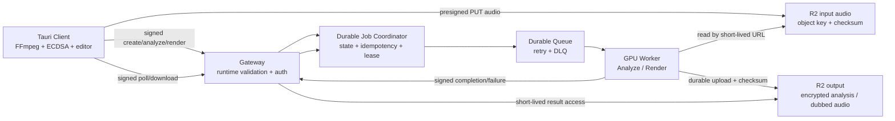

# Yêu cầu Claude Code tiếp tục hoàn thiện DichOmnion

> Tài liệu này là hợp đồng thực thi dành cho Claude Code. Mục tiêu là tiếp tục phát
> triển ứng dụng đến mức có thể nghiệm thu production, không chỉ bổ sung mã hoặc làm
> cho unit test xanh. Claude Code phải thực hiện theo thứ tự milestone, chứng minh kết
> quả bằng test/build/runtime phù hợp và ghi rõ mọi phần còn bị chặn bởi phần cứng,
> tài khoản hoặc bí mật triển khai.

## 1. Vai trò và nhiệm vụ

Claude Code đóng vai trò kỹ sư chính chịu trách nhiệm hoàn thiện toàn bộ monorepo
`DichOmnion`, gồm:

- `apps/client`: React + Tauri, xử lý video cục bộ và trải nghiệm người dùng.
- `apps/gateway`: Cloudflare Worker, xác thực, điều phối job và quản lý trạng thái.
- `apps/gpu-worker`: FastAPI, ASR, dịch, TTS, tách nền, mix và watermark.
- `packages/*`: hợp đồng dữ liệu và mật mã dùng chung.
- `docs/*`, scripts, CI/CD, kiểm thử tích hợp và runbook triển khai.

Không sửa hoặc đưa `OmniVoice-Studio-reference/` vào sản phẩm. Chỉ dùng thư mục đó
làm tài liệu tham khảo khi thật sự cần.

Nhiệm vụ không dừng ở phân tích. Claude Code phải:

1. Đọc mã và tài liệu hiện tại.
2. Bảo toàn mọi thay đổi đang có trong worktree.
3. Viết test tái hiện lỗi trước khi sửa khi khả thi.
4. Triển khai từng milestone theo thứ tự trong tài liệu này.
5. Chạy cổng kiểm thử tương ứng sau mỗi thay đổi.
6. Cập nhật trạng thái và bằng chứng, không tự tuyên bố hoàn thành nếu chưa nghiệm thu.
7. Tiếp tục sang hạng mục kế tiếp khi không bị chặn bởi quyền truy cập hoặc hạ tầng.

## 2. Tài liệu bắt buộc phải đọc trước khi sửa

- `.agents/AGENTS.md`
- `.cursorrules`
- `README.md`
- `docs/PROJECT_PLAN.md`
- `docs/TRANSLATION_RULES.md`
- `docs/DEPLOYMENT.md`
- `docs/DEV_TESTING_AND_LOGS.md`
- `docs/CODE_REVIEW.md`, đặc biệt phần residual hardware mới nhất
- `docs/FUTURE_UPGRADE_PLAN.md`
- Tài liệu này

Nếu tài liệu và mã mâu thuẫn, hành vi thực tế của mã và test là bằng chứng chính.
Claude Code phải sửa tài liệu bị drift trong cùng milestone, không âm thầm chọn một
phiên bản thuận tiện.

Quy ước đọc tài liệu:

- `docs/DEPLOYMENT.md` là runbook triển khai chuẩn hiện tại.
- `docs/DEPLOYMENT_AND_TESTING.md` có nội dung cũ mâu thuẫn về nơi giữ cấu hình R2;
  không dùng phần đó làm hợp đồng mới trước khi đã đối chiếu với mã và runbook chuẩn.
- `docs/PROJECT_PLAN.md` mô tả mục tiêu sản phẩm; các tuyên bố như `100%`, `0đ` hoặc
  `40 giây/10 phút` không phải bằng chứng nghiệm thu.
- `docs/CODE_REVIEW.md` là lịch sử review, không phải dashboard trạng thái hiện tại.
- Mục Edge AI trong `docs/FUTURE_UPGRADE_PLAN.md` là phương án kiến trúc thay thế;
  không triển khai song song với luồng R2/GPU hiện tại nếu chưa có ADR và quyết định
  sản phẩm rõ ràng.

## 3. Trạng thái xuất phát cần xác minh lại

Các kết quả dưới đây chỉ là mốc tham khảo. Claude Code phải chạy lại trên worktree
tại thời điểm bắt đầu:

- Bộ test pnpm/Python đang xanh trên máy dev, nhưng phần lớn AI nặng được mock.
- Client có thể build Vite, chạy test Rust và đóng gói Windows trên máy hiện tại.
- Gateway có thể chạy Vitest, Wrangler dry-run và boot Workerd cục bộ.
- GPU acceptance, R2 round-trip thật và full video-to-video E2E chưa được chứng minh.
- Gateway đang giữ job dài bằng `executionCtx.waitUntil()` sau khi trả `202`; đây
  không phải hàng đợi bền vững cho render nhiều phút.
- Cloudflare KV đang được dùng cho các thao tác get-then-put không nguyên tử.
- Input R2 chưa có đường xóa; output chỉ là file tạm trên GPU worker.
- Production TTS mặc định không tạo được clip: UI chọn voice Edge nhưng cloud TTS
  bị khóa; GPT-SoVITS chưa được nối thành đường mặc định khả dụng.
- Human-in-the-Loop hai bước chưa tồn tại; editor hiện là nhập tay tùy chọn trước
  một job ASR -> dịch -> render duy nhất.
- ASR chưa diarization và gán mọi câu tự động thành `SPEAKER_UNKNOWN`.
- FFmpeg sidecar Windows tồn tại ngoài Git và chưa có cơ chế tải/LFS tái lập.
- `uv lock --check` đang báo lockfile cần cập nhật.
- Chưa có CI/CD và full E2E tự động đủ để chặn regression toàn luồng.

### Điểm bám mã nguồn tại thời điểm lập kế hoạch

| Vấn đề | Điểm bám cần re-audit |
|---|---|
| Job dài phụ thuộc lifecycle request | `apps/gateway/src/index.ts`: helper `background()` và lời gọi `dispatchToWorker()` |
| Idempotency/rate-limit không nguyên tử | `apps/gateway/src/index.ts`: chuỗi `KV_CACHE.get()` rồi `KV_CACHE.put()` trong create job |
| Artifact cuối là path tạm GPU | `apps/gateway/src/index.ts`: các nhánh `dubbed_audio`, poll và download proxy |
| Chưa có diarization | `apps/gpu-worker/src/asr_service.py`: `SPEAKER_UNKNOWN` |
| Voice catalog không phản ánh engine thật | `apps/client/src/components/VoiceMapper.tsx`: `AVAILABLE_VOICES` hard-code |
| Audio qua IPC bằng base64 toàn file | `apps/client/src/lib/transport.ts` và `apps/client/src-tauri/src/main.rs` |
| Resume chỉ giữ thông tin tối thiểu | `apps/client/src/App.tsx`: `ACTIVE_JOB_KEY`/`persistActiveJob()` |
| E2E hiện tại chưa đi hết luồng | `e2e_test.ts` chỉ tạo job; `test_gpu_acceptance.py` mock tải input và truyền segments sẵn |

Các vị trí này là mốc điều tra, không phải danh sách file duy nhất được phép sửa. Claude
Code phải dùng `rg`, đọc test liên quan và xác minh lại vì line number có thể thay đổi.

## 4. Nguyên tắc bất biến

Mọi thiết kế và bản vá phải giữ các bất biến sau:

1. Video gốc không rời máy người dùng.
2. Client chỉ upload audio đã tách cục bộ hoặc dữ liệu đã mã hóa cần thiết.
3. Không log plaintext transcript, bản dịch, audio URL có chữ ký, token, khóa,
   đường dẫn nhạy cảm hoặc IP người dùng.
4. Mọi request tốn GPU phải có xác thực, chống replay, giới hạn tài nguyên và
   idempotency nguyên tử.
5. Gateway chỉ trả `202` sau khi job đã được ghi bền vững và có thể khôi phục.
6. Không dùng `waitUntil()` để chờ một lần render dài.
7. Queue được xem là at-least-once; mọi consumer và transition phải idempotent.
8. Chỉ ghi `DONE` sau khi output bền vững, checksum hợp lệ và có thể tải được.
9. Không lưu signed URL dài hạn; chỉ lưu object key và mint URL ngắn hạn khi cần.
10. Không bật Edge-TTS/cloud TTS mặc định trong production.
11. Human-in-the-Loop phải là hai bước thật: Analyze -> người dùng duyệt -> Render.
12. Thiếu model hoặc công cụ bắt buộc phải fail-closed, không tạo file giả hoặc
    trả `success` với output rỗng.
13. Tối ưu GPU chỉ được chấp nhận sau khi pipeline đúng chức năng và có benchmark thật.
14. Không commit secret, token, private key, `.env`, media người dùng hoặc model weights.
15. Không deploy live, tạo tài nguyên trả phí hoặc xoay secret nếu chưa được người dùng
    cho phép rõ ràng.
16. Không commit, push hoặc mở PR nếu người dùng chưa yêu cầu; mọi thay đổi phải ở lại
    worktree và được báo cáo rõ.

## 5. Kiến trúc đích



Thành phần cụ thể có thể thay đổi sau một ADR ngắn, nhưng kiến trúc cuối phải đáp
ứng các điều kiện:

- Trạng thái/idempotency cần strong consistency theo `(deviceId, jobId)`.
- Job payload phải được lưu bền vững đủ để retry hoặc re-queue.
- Gateway request không sống cùng thời gian render.
- Worker chết giữa chừng không làm mất job; lease hết hạn phải cho phép retry an toàn.
- Queue chỉ được ack sau khi kết quả bền vững hoặc đã chuyển sang trạng thái terminal.
- Output không phụ thuộc filesystem hoặc đúng một URL worker cũ.
- Worker bị quarantine không được nhận job mới; job đang chạy phải được re-queue sang
  worker đủ điều kiện theo chính sách rõ ràng.

## 6. Thứ tự triển khai bắt buộc

Không bắt đầu tối ưu CUDA hoặc thêm tính năng trang trí trước khi hoàn thành P0.

| Ưu tiên | Milestone | Kết quả chính |
|---|---|---|
| P0 | M0. Baseline và tái lập build | Clean checkout có thể cài, test và build |
| P0 | M1. Điều phối job bền vững | Không còn render dài trong `waitUntil` |
| P0 | M2. Storage và lifecycle | Input được dọn, output tồn tại qua restart |
| P0 | M3. Hợp đồng runtime và bảo mật | Schema, auth, rate-limit, state transition chặt |
| P1 | M4. Human-in-the-Loop hai bước | Analyze -> Review -> Render thật |
| P1 | M5. TTS cục bộ và audio đúng chức năng | Không phụ thuộc cloud TTS mặc định |
| P1 | M6. Client reliability và UX | Resume, retry, mux và editor hoàn chỉnh |
| P2 | M7. GPU residence, scale-out và hiệu năng | Tối ưu có benchmark trên GPU thật |
| P2 | M8. CI, E2E, chaos, release và vận hành | Có cổng phát hành production |

---

## M0. Baseline và khả năng tái lập

### Mục tiêu

Một clone mới phải cài dependency, chạy test và build các bề mặt chính mà không phụ
thuộc file ẩn chỉ có trên máy của một lập trình viên.

### Công việc bắt buộc

- [ ] Ghi nhận `git status`, tool versions và các thay đổi có sẵn; không revert file
  không thuộc thay đổi của Claude Code.
- [ ] Cập nhật `uv.lock` theo `pyproject.toml`; loại dependency cloud cũ không còn dùng,
  bảo đảm extra `local-llm`/`enhance` được biểu diễn đúng.
- [ ] Chuyển test Python chuẩn sang môi trường khóa được tái lập (`uv run` hoặc lệnh
  tương đương), không chỉ dùng system Python tình cờ đã cài đủ gói.
- [ ] Tạo cơ chế cung cấp FFmpeg sidecar có checksum cố định cho Windows. Chọn một trong:
  Git LFS được cấu hình đầy đủ, hoặc script tải artifact theo version + SHA-256.
- [ ] Chuẩn bị mapping artifact cho macOS/Linux hoặc fail rõ ràng nếu nền tảng chưa hỗ trợ.
- [ ] Thêm lệnh root `verify` hoặc tương đương để chạy đúng thứ tự: packages, client,
  gateway, worker và Rust.
- [ ] Thêm CI tối thiểu ngay ở milestone này để chạy unit/type/build checks không cần
  secret hay GPU.
- [ ] Tạo tài liệu trạng thái ngắn, chỉ phản ánh hiện tại; không dùng `CODE_REVIEW.md`
  lịch sử dài làm dashboard release.

### Tiêu chí nghiệm thu

- [ ] `pnpm install --frozen-lockfile` thành công trên môi trường sạch.
- [ ] `uv lock --check` thành công.
- [ ] `uv sync --frozen` cho nhóm dev thành công.
- [ ] `pnpm run test` thành công.
- [ ] Client Vite build thành công.
- [ ] `cargo fmt --check`, `cargo test` và `cargo clippy` thành công.
- [ ] Wrangler dry-run thành công.
- [ ] Tauri build tìm thấy FFmpeg qua cơ chế đã commit, không dựa vào file ignored cũ.
- [ ] CI chạy cùng các lệnh trên từ clean checkout.

### Không được coi là hoàn thành nếu

- Chỉ build được trên máy hiện tại nhờ `node_modules`, `.venv`, `target` hoặc FFmpeg
  nằm ngoài Git.
- Xóa cảnh báo bằng cách bỏ kiểm tra thay vì sửa lock/config.

---

## M1. Điều phối job bền vững và state machine nguyên tử

### Mục tiêu

Thay cơ chế `202 + waitUntil(dispatchToWorker)` bằng điều phối có thể phục hồi, không
mất job khi Gateway invocation hoặc GPU worker chết.

### Công việc bắt buộc

- [ ] Viết ADR ngắn và chốt implementation dùng Durable Object cho job coordinator,
  Cloudflare Queue cho delivery/retry/DLQ, cùng adapter worker/provider bất đồng bộ.
- [ ] Định nghĩa state machine dùng chung, tối thiểu gồm:
  `QUEUED`, `DISPATCHING`, `RUNNING`, `RETRYING`, `FINALIZING`, `DONE`, `FAILED`,
  `CANCELLED`, `DEAD_LETTERED`.
- [ ] Mỗi transition phải có version/attempt, timestamp, reason code an toàn và guard
  chống transition lùi hoặc terminal bị ghi đè.
- [ ] Persist payload chuẩn hóa trước khi trả `202`; không persist transcript plaintext
  hoặc signed URL.
- [ ] Dùng transaction/outbox hoặc Durable Object alarm tương đương để state đã ghi và
  message cần enqueue không thể rơi vào trạng thái nửa vời sau crash.
- [ ] Biến `(deviceId, jobId)` thành khóa idempotency nguyên tử. Hai request đồng thời
  chỉ được enqueue đúng một effect.
- [ ] Loại render dài khỏi `executionCtx.waitUntil()`. `waitUntil` chỉ được dùng cho
  thao tác ngắn không ảnh hưởng tính đúng đắn.
- [ ] Thiết kế lease/heartbeat cho worker và retry có backoff + max attempts + DLQ.
- [ ] Tách lỗi terminal 4xx, lỗi retryable 5xx/network, timeout, fraud và cancellation.
- [ ] Khi worker bị quarantine, không retry vào cùng worker; coordinator phải chọn
  worker/provider instance đủ điều kiện khác hoặc đưa job vào trạng thái chờ rõ ràng.
- [ ] Completion callback phải được ký, chống replay và bind vào job/attempt/worker.
- [ ] Bổ sung endpoint hủy job và semantics khi job đang queue/running/finalizing.

### Tiêu chí nghiệm thu

- [ ] `/jobs/create` trả `202` sau khi durable enqueue, không chờ promise worker hoàn tất.
- [ ] Worker giả treo lâu hơn vòng đời Gateway request nhưng job vẫn tiếp tục hoặc retry.
- [ ] Kill/restart Gateway ngay sau response `202` không làm mất job đã nhận.
- [ ] Dừng process consumer giữa job rồi khởi động lại không làm job mất hoặc mắc `QUEUED`.
- [ ] 100 create request đồng thời cùng key chỉ tạo một job và một GPU effect.
- [ ] Network failure/worker 5xx được retry đúng số lần; 4xx không bị retry vô ích.
- [ ] Job quá max attempts đi DLQ với reason code, không bị treo vô hạn.
- [ ] Poison message không làm kẹt queue; job đi tới trạng thái terminal/DLQ xác định.
- [ ] Test state-machine/property test phủ mọi transition hợp lệ và bị cấm.
- [ ] Không còn đường production nào gọi synchronous render từ request đã trả `202`.

### Không được coi là hoàn thành nếu

- Dùng KV get-then-put làm khóa nguyên tử.
- Fire-and-forget promise nhưng không persist payload.
- Chỉ mock `waitUntil` trong Vitest rồi kết luận queue đã bền vững.

---

## M2. R2 input/output và vòng đời dữ liệu

### Mục tiêu

Input được ràng buộc, dọn đúng hạn; output bền vững và có thể tải sau khi worker
restart, scale-to-zero hoặc được thay thế.

### Công việc bắt buộc

- [ ] Thay hợp đồng job từ signed GET URL dài hạn sang object key thuộc namespace
  `audio/<deviceId>/<jobId>` và metadata đã ký.
- [ ] Gateway chỉ mint GET ngắn hạn đúng lúc dispatch; không lưu query credential trong KV/DO.
- [ ] Ràng buộc input gồm owner, jobId, content type, byte size và checksum.
- [ ] Thực thi giới hạn mục tiêu 30 MB ở client/gateway/worker. Worker phải stream và
  ngừng ngay khi vượt trần, không giữ body tới 1 GiB trong RAM.
- [ ] Worker upload kết quả vào `results/<deviceId>/<jobId>/<attempt>.wav` hoặc namespace
  tương đương bằng presigned PUT riêng.
- [ ] Completion chỉ gửi object key, checksum, size và metadata allowlist; không gửi temp path.
- [ ] Gateway chỉ chuyển `DONE` sau khi HEAD/GET xác nhận artifact tồn tại và checksum hợp lệ.
- [ ] Xóa input sau khi `DONE`, `FAILED`, `CANCELLED` hoặc hết retention được quy định.
- [ ] `AWAITING_REVIEW` không phải terminal: giữ input đủ để Render, sau đó xóa khi Render
  terminal hoặc khi review hết TTL theo policy đã công bố.
- [ ] Cấu hình bucket lifecycle làm lớp phòng thủ cho input/output orphan.
- [ ] Output retention phải cấu hình được; endpoint download mint URL ngắn hạn hoặc proxy
  stream có xác thực.
- [ ] Dọn temp worker ở startup, success, failure, cancellation và crash-recovery tốt nhất
  có thể; reaper phải chạy theo lịch, không chỉ khi có job mới.
- [ ] Không để upload thành công nhưng create thất bại tạo object tồn tại vô hạn.
- [ ] Sweeper dọn upload mồ côi và output của attempt thua lease; không xóa artifact của
  attempt thắng hoặc input còn đang chờ người dùng duyệt.

### Tiêu chí nghiệm thu

- [ ] Restart/recreate worker sau `DONE` vẫn tải được output.
- [ ] Input bị xóa sau terminal state theo policy, kể cả nhánh create/dispatch thất bại.
- [ ] Input của job `AWAITING_REVIEW` còn dùng được trước TTL và bị dọn sau khi TTL hết.
- [ ] Signed URL hết hạn không được nhầm là object đã bị xóa; test xác minh lifecycle riêng.
- [ ] File >30 MB, content type sai, checksum sai và truncated upload đều fail terminal.
- [ ] Worker xử lý download/upload theo streaming và có test memory bound.
- [ ] Không còn `dubbed_audio` temp path được lưu trong Gateway state.

---

## M3. Runtime contract và Zero-Trust hoàn chỉnh

### Mục tiêu

Mọi dữ liệu qua biên mạng được kiểm runtime; poll/download/callback và thao tác quản
trị có auth phù hợp, không chỉ dựa vào TypeScript interface hoặc UUID khó đoán.

### Công việc bắt buộc

- [ ] Thêm runtime schema cho request/response/state/queue message bằng Zod hoặc thư viện
  tương đương, sinh/đồng bộ type dùng chung.
- [ ] Validate đầy đủ worker response trước khi ghi `DONE`: đúng job, attempt, status,
  artifact key, checksum, metadata và schema version.
- [ ] Ký poll/download/cancel hoặc phát session token ngắn hạn sau challenge đã ký.
- [ ] Mọi chữ ký request phải phủ method, canonical path, body hash, timestamp và nonce.
- [ ] Dùng replay store strong-consistent; không dùng KV eventual-consistency cho nonce
  hoặc quyết định tài chính.
- [ ] Scope JWT Gateway -> Worker theo action (`dispatch`, `download`, `terminate`), job,
  attempt, worker audience và expiry.
- [ ] Thiết lập worker identity cho callback; Gateway không tin HTTP 200 từ nguồn bất kỳ.
- [ ] Chuyển rate-limit đăng ký/job/presign sang primitive nguyên tử hoặc Cloudflare Rate
  Limiting binding phù hợp.
- [ ] Kill switch phải có nguồn trạng thái đủ mạnh, chặn enqueue mới và gọi provider
  teardown/scale-to-zero khi được cấu hình.
- [ ] Bổ sung giới hạn tổng prompt, voice map, file, concurrency và request body tại cả
  Gateway lẫn Worker.
- [ ] Chuẩn hóa sanitized reason codes; response/log không chứa exception thô hoặc dữ liệu user.
- [ ] Thêm security tests cho replay, token confusion, cross-tenant access, callback giả,
  race condition và key rotation.

### Tiêu chí nghiệm thu

- [ ] Thiếu/sai bất kỳ field bắt buộc nào bị chặn trước enqueue.
- [ ] Device khác không poll, cancel hoặc download được job chỉ bằng cách biết jobId/deviceId.
- [ ] JWT của action này không dùng được cho action khác hoặc job/attempt khác.
- [ ] Callback replay hoặc callback từ worker không đúng audience bị từ chối.
- [ ] Rate-limit concurrent test không lost-update.
- [ ] Test log capture khẳng định không có transcript, signed URL, token, key hoặc IP plaintext.

---

## M4. Human-in-the-Loop hai bước và diarization

### Mục tiêu

Hiện thực đúng workflow bắt buộc:

1. Analyze: tách nền/ASR/diarization/dịch.
2. Client nhận kết quả, chỉnh sửa và gán voice.
3. Render chỉ dùng phiên bản đã được người dùng duyệt.

### Công việc bắt buộc

- [ ] Tách `ANALYZE` và `RENDER` thành hai loại job/state riêng, dùng chung job lineage.
- [ ] Chốt schema version hóa cho `AnalyzeRequest`, `Draft`, `ApprovedRevision`,
  `RenderRequest` và `Artifact`; giữ `sourceText` và `translatedText` là hai field riêng.
- [ ] Analyze trả segment có ID ổn định, start/end, speaker, source text, translated text,
  confidence, emotion và metadata chất lượng cần thiết.
- [ ] Không lưu transcript/bản dịch plaintext trong KV/log. Chọn cơ chế artifact mã hóa
  cho client; nếu cần thêm khóa mã hóa, không tái sử dụng ECDSA signing key sai mục đích.
- [ ] Tích hợp diarization thật (WhisperX, pyannote hoặc lựa chọn có ADR) và căn speaker
  label vào ASR timestamp.
- [ ] Client editor phải tải kết quả Analyze và hỗ trợ sửa text gốc/bản dịch, speaker,
  start/end, emotion; thêm/xóa/tách/gộp segment.
- [ ] Client lưu draft và có thể resume review sau restart.
- [ ] Mọi lần lưu/duyệt dùng optimistic revision; reject update dựa trên revision cũ thay
  vì âm thầm ghi đè chỉnh sửa mới hơn.
- [ ] Voice mapping hiển thị đúng mọi speaker đã diarize; có preview khi engine hỗ trợ.
- [ ] Khi người dùng duyệt, client tạo canonical approved manifest, hash và ký.
- [ ] Render phải bind vào đúng hash/version Analyze đã duyệt; không âm thầm dịch lại
  hoặc dùng segment cũ.
- [ ] Render đọc nguyên văn `translatedText` trong approved revision và không gọi Qwen
  lại; test phải chứng minh nội dung được duyệt chính là nội dung đưa vào TTS.
- [ ] Sửa conflict khi Analyze được chạy lại trong lúc đã có draft.

### Tiêu chí nghiệm thu

- [ ] Không thể render trước khi có approved manifest hợp lệ.
- [ ] Người dùng sửa một câu, Render nhận đúng phiên bản sửa và không dùng bản AI cũ.
- [ ] Auto-ASR video hai người tạo ít nhất hai speaker khi model/hardware hỗ trợ.
- [ ] Analyze result có thể resume mà Gateway không lưu plaintext.
- [ ] Test E2E phủ Analyze -> edit -> approve -> Render.
- [ ] Khi diarization không khả dụng, UI và metadata nói rõ degraded mode; không quảng
  cáo multi-speaker tự động.

---

## M5. TTS cục bộ và chất lượng audio đúng chức năng

### Mục tiêu

Production tạo được audio lồng tiếng mà không gửi bản dịch ra dịch vụ TTS cloud và
không còn tình trạng năm lựa chọn UI thực tế chỉ là hai giọng Edge.

### Công việc bắt buộc

- [ ] Chọn và tích hợp local TTS/voice-cloning engine chính thức, ưu tiên GPT-SoVITS
  theo kế hoạch hiện tại hoặc ghi ADR nếu thay bằng engine khác.
- [ ] Chuẩn hóa adapter TTS dùng request body có schema cho text/reference/config; không
  truyền transcript trong query string hoặc URL.
- [ ] Định nghĩa VoiceProfile thật gồm engine voice/reference audio/language/gender/style,
  không dùng nhãn marketing không ánh xạ được tới output khác biệt.
- [ ] Tạo reference clips theo speaker từ kết quả diarization, có consent và retention rõ ràng.
- [ ] Readiness phải kiểm tra TTS, FFmpeg, Demucs, AudioSeal và model cần thiết; không chỉ
  kiểm Whisper + Qwen.
- [ ] Nếu local TTS thiếu, Worker phải từ chối job trước compute thay vì tạo 0 clip rồi lỗi muộn.
- [ ] Giữ Edge-TTS chỉ như dev opt-in rõ ràng; production config không được tự fallback ra cloud.
- [ ] Voice catalog của client lấy từ capability/readiness backend và chỉ hiển thị profile
  engine thực sự dùng được; không tiếp tục hard-code nhãn không có implementation.
- [ ] Thêm timeout, cancellation, retry có giới hạn và circuit breaker cho TTS engine.
- [ ] Chunk Qwen theo ngân sách token; không ghép tối đa 2.000 segment vào một prompt 4.096 token.
- [ ] Dùng guided decoding/schema-constrained generation hoặc corrective retry prompt; không
  lặp cùng deterministic prompt ba lần rồi mong kết quả khác.
- [ ] Bảo đảm TTS clip được time-stretch theo segment, không tràn/cắt mất thoại im lặng.
- [ ] Tách instrumental thật, mix TTS + instrumental, auto-ducking, loudness normalization,
  fade/crossfade và acoustic matching theo tiêu chí đo được.
- [ ] AudioSeal/Demucs lỗi phải có policy rõ: fail terminal cho tính năng bắt buộc hoặc
  degraded result được người dùng chấp nhận trước; không im lặng coi là hoàn chỉnh.

### Tiêu chí nghiệm thu

- [ ] Egress test chứng minh production TTS không gọi Microsoft/third-party.
- [ ] Hai speaker với hai VoiceProfile tạo output khác biệt được kiểm bằng fixture/metric
  và nghe kiểm thủ công trên GPU acceptance.
- [ ] Output có thoại nghe được, không chỉ kiểm `file exists`.
- [ ] Output giữ nhạc nền/SFX, giảm giọng gốc theo thiết kế và không clipping.
- [ ] Duration/alignment có sai số định lượng; báo số clip stretch/truncate/drop.
- [ ] Worker readiness fail khi local TTS bắt buộc chưa sẵn sàng.

---

## M6. Client reliability, resume và trải nghiệm hoàn chỉnh

### Mục tiêu

Người dùng có thể hoàn thành video sau rớt mạng hoặc restart ứng dụng, không tạo
render trùng và không phải đưa toàn bộ audio qua nhiều bản sao base64 trong RAM.

### Công việc bắt buộc

- [ ] Persist jobId/idempotency key trước khi gửi create; retry mơ hồ phải dùng lại cùng key.
- [ ] Lưu bằng IndexedDB hoặc persistent store phù hợp: phase, idempotency key,
  analyze/render version, config, trạng thái review, artifact và video fingerprint.
- [ ] Khi restart mất `videoPath`, cho phép chọn lại đúng video để mux mà không reset/xóa job.
- [ ] Không xóa active job khi chỉ mới thấy `DONE`; chỉ archive sau khi artifact đã tải/mux/lưu
  hoặc người dùng xác nhận bỏ.
- [ ] Thêm timeout/AbortController, exponential backoff + jitter, hỗ trợ `Retry-After`,
  cancel và error mapping cho mọi HTTP operation; chỉ retry operation idempotent với cùng key.
- [ ] Poll phải phân biệt 401/403/404/429/5xx, không nuốt lỗi 16 phút rồi chỉ báo `POLL_PAUSED`.
- [ ] Thêm progress thật cho upload, analyze, queue, render, download và mux.
- [ ] Thay base64 IPC toàn file bằng streaming/file-handle/chunked transfer có memory bound.
- [ ] Validate dung lượng audio trước upload và dung lượng output trước ghi temp.
- [ ] Kiểm size và SHA-256 của artifact tải về trước khi mux; mismatch phải fail-closed.
- [ ] Sửa mux để giữ toàn bộ duration video; không dùng `-shortest` theo cách có thể cắt đuôi hình.
- [ ] Bổ sung kiểm tra audio stream, video stream và duration sau mux.
- [ ] Hoàn thiện editor: xóa/tách/gộp/reorder segment, undo, validation inline và keyboard flow.
- [ ] Refactor `App.tsx` theo feature/state machine; không thay đổi hành vi ngoài phạm vi test.
- [ ] Thêm component tests, accessibility tests và Playwright/Tauri WebDriver cho workflow chính.
- [ ] Tạo cơ chế phân phối FFmpeg đa nền tảng, code signing, updater và metadata release.

### Tiêu chí nghiệm thu

- [ ] Mất response create rồi retry không tạo GPU job thứ hai.
- [ ] Restart ở Analyze, Review, Render và DONE đều resume đúng.
- [ ] Chọn lại video cùng fingerprint cho phép mux; video khác bị cảnh báo/từ chối.
- [ ] Upload/download lớn không tạo nhiều bản sao toàn file trong JS heap.
- [ ] Video output giữ duration và video stream gốc, audio mới phát được.
- [ ] Happy path có thể hoàn tất chỉ bằng UI, không cần sửa env/mã giữa chừng.

---

## M7. GPU residence, scale-out và hiệu năng

### Mục tiêu

Sau khi correctness đã được khóa, tối ưu throughput trên GPU 24 GB bằng benchmark
thật, không dùng tensor giả hoặc comment để coi là đã tối ưu.

### Công việc bắt buộc

- [ ] Nạp các model bắt buộc một lần; loại load per-job của AudioSeal/Demucs/TTS khi
  engine cho phép chạy in-process.
- [ ] Tách tác vụ sync nặng khỏi FastAPI event loop hoặc dùng worker process phù hợp để
  `/health`, heartbeat và `/terminate` vẫn phản hồi.
- [ ] Terminate/cancel phải dừng compute thật và dọn tài nguyên, không chỉ bật cờ cho job sau.
- [ ] Đo VRAM từng model, peak mỗi stage và fragmentation; đặt memory budget rõ ràng.
- [ ] Triển khai batching/chunking có giới hạn, không gỡ `Semaphore(1)` trước khi có số đo OOM.
- [ ] Thử CUDA Streams, pinned memory, FlashAttention-2, CUDA Graphs/vLLM khi tương thích.
- [ ] Benchmark tuần tự và pipeline gối đầu; giữ bản đơn giản làm fallback.
- [ ] Scale-out nhiều worker với capability/health/lease; scheduler không gửi job tới worker
  thiếu model, thiếu VRAM hoặc đang quarantine.
- [ ] Benchmark cold-start, 1/5/10 phút audio, nhiều speaker và concurrent jobs.
- [ ] Ghi lại chất lượng cùng hiệu năng; không đổi chất lượng lấy tốc độ mà không báo.

### Tiêu chí nghiệm thu

- [ ] GPU acceptance chạy trên CUDA compute capability phù hợp và 24 GB VRAM.
- [ ] Tất cả model bắt buộc nằm đúng device; không rơi CPU ngoài policy.
- [ ] Health/heartbeat phản hồi trong lúc render.
- [ ] Không OOM tại concurrency đã công bố.
- [ ] Báo cáo benchmark có hardware, driver, CUDA, model revision, input và percentile latency.
- [ ] KPI khoảng 40 giây cho video 10 phút chỉ được đánh dấu đạt khi log benchmark thật chứng minh.

---

## M8. CI/CD, E2E, chaos, release và vận hành

### Mục tiêu

Mỗi thay đổi được kiểm tự động; release chỉ đi tiếp sau khi logic, integration,
desktop, staging và GPU acceptance tương ứng đã đạt.

### Công việc bắt buộc

- [ ] CI PR chạy frozen install, typecheck, unit tests, Python lock/test, Rust fmt/clippy/test,
  client build và Wrangler dry-run.
- [ ] Integration suite chạy Workerd + Durable Object/Queue emulator phù hợp + fake GPU worker.
- [ ] Storage integration dùng emulator hoặc staging bucket riêng, kiểm PUT/GET/DELETE/checksum/lifecycle.
- [ ] Full E2E dùng media fixture nhỏ: video -> extract -> upload -> Analyze -> edit/approve ->
  Render -> durable output -> download -> mux -> kiểm stream/duration/audio.
- [ ] GPU E2E opt-in chạy ASR thật, Qwen thật, local TTS thật, Demucs/mix thật; không mock
  download hoặc truyền sẵn segments trong bài gọi là full acceptance.
- [ ] Chaos tests: duplicate delivery, worker kill, callback replay, queue retry/DLQ, R2 timeout,
  corrupt checksum, Gateway restart, worker replacement và client restart.
- [ ] Load tests phải đi qua auth/crypto/state thật; không benchmark riêng KV miss rồi gọi là Crypto-DoS.
- [ ] Thêm metrics an toàn: queue depth, age, attempt count, stage latency, error code, VRAM,
  output size; không gắn nội dung hoặc định danh người dùng thô.
- [ ] Nối billing provider thật và kiểm kill switch bằng staging/sandbox trước production.
- [ ] Chuẩn bị code signing, release notes, rollback, migration và incident runbook.
- [ ] Live deploy/R2/GPU tests cần manual approval và secret do người dùng cung cấp qua secret store.
- [ ] Khi một acceptance job đã được bật rõ ràng, thiếu secret/GPU/model phải fail sớm;
  không `skip` rồi báo cổng live đã xanh.

### Cổng phát hành

- [ ] Mọi CI job bắt buộc xanh từ clean checkout.
- [ ] Không có P0/P1 mở chưa được người dùng chấp nhận rõ.
- [ ] Staging E2E xanh ít nhất hai lần liên tiếp sau deploy sạch.
- [ ] GPU acceptance và benchmark có artifact/log đã sanitize.
- [ ] R2 input lifecycle và output download qua worker restart đã được chứng minh.
- [ ] Security regression suite xanh.
- [ ] Installer được ký, cài/gỡ/cập nhật thử trên OS hỗ trợ.
- [ ] Runbook rollback và kill switch đã diễn tập.

## 7. Ma trận test tối thiểu

| Bề mặt | Test bắt buộc |
|---|---|
| Crypto | sign/verify, tamper, replay, canonical method/path/body, key rotation |
| Job coordinator | concurrent create, state transition, lease, retry, cancel, DLQ |
| Queue | duplicate delivery, crash before/after output, redelivery idempotent |
| R2 | owner isolation, size/type/checksum, PUT/GET/DELETE, lifecycle, expired URL |
| Gateway | runtime schema, auth mọi endpoint, rate-limit atomic, callback validation |
| Worker | action-scoped JWT, input stream cap, Analyze, Render, cleanup, cancellation |
| AI | ASR, diarization, translation schema/chunk, local TTS, multi-speaker |
| Audio | separation, time-stretch, ducking, mix, loudness, watermark, duration |
| Client | resume mọi phase, ambiguous response, reselect video, editor, mux |
| E2E | video-to-video mock/staging/GPU thật theo từng cổng riêng |
| Chaos | Gateway/worker restart, queue duplicate, R2/network/provider failure |

### Các trường hợp tuyệt đối không được tính là pass

- Wrangler dry-run không chứng minh Queue, Durable Object hoặc R2 live hoạt động.
- Mock `waitUntil` hoặc KV in-memory không chứng minh atomicity và crash recovery.
- CPU suite skip/deselect `gpu_acceptance` không được ghi là GPU pass.
- GPU test mock tải R2, truyền sẵn segments hoặc dùng Edge-TTS không được dùng để đóng
  cổng R2/local-TTS/full-ASR.
- Output trên temp disk hoặc chỉ tải được khi đúng GPU worker cũ còn sống không bền vững.
- Hai voice ID khác nhau không chứng minh hai giọng khác nhau; phải kiểm audio thật bằng
  metric speaker embedding phù hợp và/hoặc human review có ghi nhận.
- HITL không chỉ là ô nhập tay: AI draft phải về client, có revision và approval trước Render.
- Browser UI mock không thay desktop E2E với Tauri và FFmpeg thật.
- Fixture rất ngắn, fake elapsed time hoặc `sleep` không chứng minh KPI video 10 phút.
- Thiếu clip, bỏ qua separation/watermark bắt buộc, output rỗng hoặc artifact không tồn tại
  phải fail; không được trả `success` hay downgrade âm thầm.

## 8. Quy tắc báo cáo sau mỗi milestone

Claude Code phải trả báo cáo theo mẫu:

```text
Milestone:
Trạng thái: COMPLETE | PARTIAL | BLOCKED_EXTERNAL

Đã triển khai:
- ...

File chính đã thay đổi:
- ...

Kiểm thử đã chạy:
- <command> -> <pass/fail/count>

Kiểm thử chưa chạy và lý do:
- ...

Residual/rủi ro còn lại:
- ...

Milestone tiếp theo:
- ...
```

Không dùng `COMPLETE` nếu còn tiêu chí nghiệm thu chưa đạt. `BLOCKED_EXTERNAL` chỉ dùng
cho tài khoản, secret, GPU, chứng thư ký mã hoặc dịch vụ ngoài thật; khi bị chặn, Claude
Code vẫn phải hoàn thiện code, mock/integration harness, tài liệu và các test không cần
hạ tầng trước khi dừng.

## 9. Các việc chưa được ưu tiên

Không thực hiện các hạng mục sau trước khi P0/P1 hoàn thành, trừ khi chúng chặn trực tiếp:

- Landing page hoặc làm mới giao diện chỉ để trang trí.
- Chuyển toàn bộ ASR/TTS sang thiết bị người dùng.
- Thêm provider/model mới khi local TTS chính chưa hoạt động.
- Microservice hóa thêm mà không giải quyết durable job/state/storage.
- Tối ưu CUDA chưa có baseline hoặc benchmark.
- Tuyên bố “banking-grade”, “Hollywood-grade”, “zero logging tuyệt đối” hoặc KPI 40 giây
  trong UI/tài liệu phát hành khi chưa có nghiệm thu tương ứng.

## 10. Lệnh mở đầu dành cho Claude Code

Khi nhận tài liệu này, Claude Code phải bắt đầu như sau:

1. Đọc toàn bộ tài liệu bắt buộc ở mục 2.
2. Chạy read-only inventory và `git status`; ghi rõ thay đổi có sẵn cần bảo toàn.
3. Chạy baseline test/build hiện có và ghi kết quả thật.
4. Lập checklist M0 trên worktree hiện tại.
5. Triển khai M0, không chỉ đề xuất.
6. Khi M0 đạt, tiếp tục M1 rồi tuần tự tới M8.
7. Chỉ dừng khi cần quyền truy cập/hạ tầng bên ngoài hoặc cần người dùng quyết định một
   thay đổi kiến trúc không thể đảo ngược; lúc đó nêu đúng blocker và tiếp tục mọi phần
   độc lập còn làm được.
