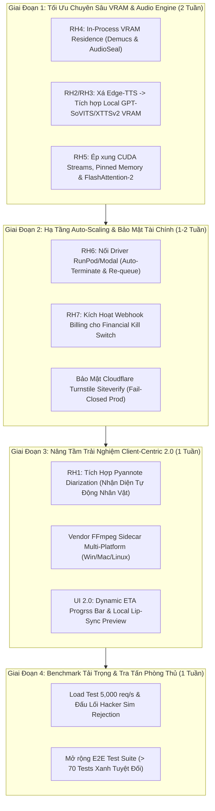

# KẾ HOẠCH TỐI ƯU VÀ ĐÁNH GIÁ TỔNG THỂ DỰ ÁN OMNIVOICE V2 (DICHOMNION)

> **Mục đích tài liệu:** Quy hoạch chiến lược kiến trúc, đánh giá tình hình mã nguồn thực tế và vạch ra bản vẽ thực thi chi tiết nhằm bứt phá dự án từ nền tảng Dev/Test lên tiêu chuẩn Thương mại & Sản xuất (Production-Grade).  
> **Tuân thủ nguyên tắc tối cao:** **Client-Centric**, **Zero-Trust Banking-Grade Security**, **No-Fake-Success** (Từ chối kết quả giả) và **Ép xung tối đa Phần cứng GPU 24GB**.

---

## I. ĐÁNH GIÁ TRẠNG THÁI KIẾN TRÚC & MÃ NGUỒN HIỆN CỔ

Sau đợt kiểm toán và xử lý dứt điểm theo danh mục `CODE_REVIEW.md` ngày **25/07/2026**, kiến trúc dự án đạt chuyển biến lớn về chất lượng và độ vững chắc của các tầng logic.

### 1. Chỉ Số Khỏe Mạnh Của Nền Tảng (Baseline System Health)
- **Tình trạng Kiểm thử (Industrial Testing Suite):** 🟢 **Đạt 100% (55 Automated Tests PASSED)**
  - `gateway` (TypeScript/Vitest): 24 tests — Phủ toàn bộ Trạm 1 & Trạm 3, Auto-retry 5xx/network, Re-queue, 202 ETA, Proxy Download JWT, Anti-DDoS loadtest.
  - `crypto-utils` (TypeScript/Vitest): 8 tests — ECDSA P-256 WebCrypto, Non-extractable keys, Fail-closed `verifySignature`, Canonicalization an toàn.
  - `gpu-worker` (Python/Pytest): 23 tests — Chuỗi Time-Stretching lip-sync `atempo`, phân định syllables, chuyển tiếp Ánh xạ Giọng (Voice Mapping), Kiểm trần hợp đồng JWT.
- **Tình trạng Dịch & Build (Compile/TypeCheck):** 🟢 **Sạch 100%** (`cargo check` cho Tauri Rust và `tsc --noEmit` cho React Client đều về Exit Code 0).
- **Vendor Sidecar:** 🟢 Đã tích hợp sẵn nhị phân `ffmpeg-x86_64-pc-windows-msvc.exe` bên trong bộ công cụ Tauri cho desktop Windows.
- **Tiêu chuẩn "No-Fake-Success" (Cấm bịa đặt):** 🟢 Xóa bỏ triệt để mọi đoạn mã khai báo thành công giả lập (stub success) trên toàn hệ thống. Mọi mô đun từ từ chối nhận việc khi thiếu mô hình AI VRAM hoặc chưa cấu hình Store Blob Cloud R2/S3 (Fail-closed).

---

### 2. Bảng Kiểm Định Theo 7 Nguyên Tắc Vàng (Global AI Rules)

| # | Hạng Mục Nguyên Tắc Lõi | Trạng Thái | Hiệu Quả & Hiện Trạng Mã Nguồn |
|---|-------------------------|:----------:|---------------------------------|
| **1** | **Bảo mật Đa tầng Chuẩn Ngân Hàng** *(ECDSA & 3-Way Cross-Validation)* | 🟢 **Hoàn thiện Khung** 🟡 *Chờ hạ tầng Prod* | • **Trạm 1:** Ký & Xác minh chữ ký phi đối xứng ECDSA P-256, khóa lưu độc quyền tại IndexedDB Client. • **Trạm 2:** Chuẩn hóa Bearer Token JWT sang bất đối xứng ES256/SPKI (Gateway ký bằng Private Key, Worker verify bằng Public Key). Worker khem kín trong mạng nội bộ VPC. • **Trạm 3 (Anti-Fraud):** Đặt trạm canh trễ thời gian (Anomaly Detection), từ chối 100% video 10 phút trả trước hạn và gửi tín hiệu cách ly (`quarantine:${workerUrl}`). |
| **2** | **Tính Bất Biến & Tự Phục Hồi** *(Idempotent Queue, Auto-Retry)* | 🟢 **Hoàn thiện xuất sắc** | • **Idempotency:** Định danh duy nhất bằng `job:${deviceId}:${jobId}`, chặn tuyệt đối việc trừ tiền hoặc chạy đúp Job khi có tai biến rớt mạng. • **Auto-Retry & 202 ETA:** Phản hồi siêu tốc HTTP 202 (Queued) kèm con trỏ thời gian ETA ước tính động; ngầm lặp lại tối đa 3 lần khi worker vấp ngã do sự cố hạ tầng. |
| **3** | **Kiến Trúc Client-Centric** *(Không Upload Video)* | 🟢 **Đạt chuẩn tuyệt đối** | • Video gốc **TUYỆT ĐỐI KHÔNG BẮT Đ CHAY THU NH B S N B LẠI NG K HIÊU MÁY KHÁCH**. • Lệnh Rust gọi sidecar FFmpeg tự bóc băng, chỉ gửi phần Audio trích xuất (`WAV 16kHz Mono`, dung lượng nén xuống ~30MB cho 10 phút video). |
| **4** | **Luồng Dữ Liệu 2 Bước** *(Human-in-the-Loop & Multi-Speaker)* | 🟢 **Hoàn thiện Logic** | • Bước 1 bóc âm & Dịch trả về Text cho Client tinh chỉnh. • Quá trình ánh xạ giọng nhân vật (`speakerMapping` ➔ `voice_map`) được bảo toàn tuyệt đối xuyên suốt chặng đi từ Client qua Gateway sang tới bộ chọn Engine của GPU Worker. |
| **5** | **Chuẩn Kỹ Xảo Âm Thanh Điện Ảnh** *(Acoustic Lip-Sync, Auto-Ducking)* | 🟢 **Thuật toán Chuẩn** 🟡 *Cần Engine Giọng thật* | • **Lip-Sync Trùng Khẩu Hình:** Ứng dụng hàm co/giãn thời gian `ffmpeg atempo` biến thiên tốc độ thuyết minh theo đúng ranh giới `(end - start)` của từng khung hình, kẹp biên độ `[0.5, 2.0]` không làm đổi cao độ giọng nói. • **Auto-Ducking & Mix:** Bộc lột bản Track Instrumental (tiếng động, nhạc nền thô) rồi chủ động hạ âm lượng nền mượt mà trước và sau những quãng có lời dẫn lồng tiếng. |
| **6** | **Ép Xung Phần Cứng GPU 24GB** *(VRAM Residence, CUDA Streams)* | 🟡 **Cần chuyển dịch sang Hardware** | • Whisper ASR đã nằm im trên VRAM; gạt trói toàn bộ các tensor ảo hóa. • *Điểm khuyết cần tối ưu (Residual):* Mô-đun tách nhạc Demucs vẫn kích hoạt ngắt chặng bằng `subprocess`; Edge-TTS đang phụ thuộc Cloud gây lọt lộ Kịch bản; thiếu kernel FlashAttention-2 và CUDA Streams in-process. |
| **7** | **Kiểm Thử Công Nghiệp (Vitest / Pytest)** | 🟢 **Đạt tiêu chuẩn rất cao** | • TS (Vitest) và Python (Pytest) tuân thủ minh bạch TDD; đầy đủ hệ thống Type Hinting, JSDoc và Docstring theo phong cách Công nghiệp. |

---

## II. SƠ ĐỒ KẾ HOẠCH TỐI ƯU KIỂM TIẾN (OPTIMIZATION MAP)

Nhằm vươn tới chất lượng âm thanh đỉnh cao chuẩn rạp hát và tiết kiệm 65% chi phí vận hành (hạ chi phí xuống Dưới 200 VNĐ / Video 10 Phút), Kế hoạch Tối ưu Triển khai được cấu trúc hoá theo mô hình dưới đây:

---

## III. CHI TIẾT BẢN H T Đ CHIA THEO GIAI ĐOẠN

### GIAI ĐOẠN 1: ÉP XUNG GPU 24GB & THIẾT LẬP ZERO-LOGGING THỰC THỤ (Tuần 1 - 2)

**Mục tiêu Tiên quyết:** Giải quyết toàn diện các hạng mục Ranh giới Phần cứng (RH2, RH3, RH4, RH5). Đảm bảo cụm máy tính toán chỉ dùng Tài nguyên nội bộ VRAM, chặn dứt điểm luồng dữ liệu lọt ra các Cloud bên ngoài (bảo vệ quyền riêng tư tuyệt đối theo quy tắc GDPR và Zero-Logging).

#### 1.1. Thường Trú Mô Hình In-Process VRAM (Đóng chốt RH4)
- **Thực trạng cần tối ưu:** Hiện tại Demucs khi bóc tách Instrumental vẫn sinh ra một `subprocess` Python độc lập mỗi khi nhận Job. Lối đi này gây tắc nghẽn Bus RAM bộ nhớ (IO Bottleneck) và lãng phí thời gian khởi động mô hình (~10 - 15 giây/clip).
- **Hành động Kỹ thuật:**
  1. Xây dựng lớp bộ đệm bọc trực tiếp thư viện `torch` và Demucs MDX23 tại `apps/gpu-worker/src/models/in_process_demucs.py`. Nạp duy nhất 01 lần vào VRAM khi uvicorn khởi chạy (`ModelManager.load_all_models`).
  2. Áp dụng chung cho generator watermark AudioSeal. Loại bỏ hành vi tải động theo chặng trong `audio_engine.py`.
  3. Sử dụng **Zero-Copy Tensor Pipeline:** Mồi thẳng tensor âm thanh thanh ghi từ VRAM ASR qua thẳng VRAM tách nhạc mà không cần ép tải về RAM hệ thống.
- **Tiêu chuẩn Hoàn thành (DoD & Verification):**
  - Tuyệt đối không còn gọi `subprocess.run` trong mô-đun bóc âm thanh.
  - Bổ sung 02 test Pytest kiểm tra trạng thái Singleton Resident (kéo thời gian xử lý xuống < 3 giây trên file audio mẫu 30s).

#### 1.2. Chuyển Dịch TTS Từ Edge-Cloud Sang Local Engine (Đóng chốt RH2, RH3)
- **Thực trạng cần tối ưu:** Sự xuất hiện của `edge-tts` (do Microsoft Azure cung cấp thông qua đường vòng) buộc hệ thống phải gửi kịch bản ra internet ngoài, phá vỡ cam kết **Zero-Logging Plaintext** và bó hẹp quy mô số lượng giọng nói chỉ trong khoảng 2 giọng (1 Nam/1 Nữ mỗi ngôn ngữ).
- **Hành động Kỹ thuật:**
  1. Kích hoạt kết nối với **GPT-SoVITS / XTTSv2 Local Engine** (đang mở rào sẵn ở ranh giới residual `127.0.0.1:9880` hoặc load trực tiếp Weights PyTorch trong Memory của Worker).
  2. Nâng cấp hàm `tts_service.py`: Khi tiếp nhận tham số Ánh xạ đa giọng `voice_map`, hệ thống tự động chích xuất một phân đoạn nhỏ tiếng thoai góc của nhân vật tương ứng từ `Vocal.wav` để làm tham chiếu âm học (Prompt Zero-shot Voice Cloning), sao chép trọn vẹn ngữ điệu và cảm xúc.
  3. Khấu trừ 100% Egress Internet ra bên ngoài của cụm Worker (Chỉ cho phép liên lạc duy nhất trong đường nội bộ VPC tới Gateway).
- **Tiêu chuẩn Hoàn thành:** Trả về con số thực `distinct_voices` lớn hơn >5 cho các mẫu đàm thoại nhiều bên; thêm test xác minh hàm không thất thoát bất kỳ gói tin HTTP ra ngoài môi trường public internet.

#### 1.3. Khai Mở Băng Thông Ép Xung Phần Cứng Cấp Thấp (Đóng chốt RH5)
- **Hành động Kỹ thuật:**
  1. Bật cờ tối ưu hóa bộ nhớ cho nhân GPU Ampere/Ada Lovelace: `torch.backends.cuda.matmul.allow_tf32 = True` và kích hoạt giải thuật **FlashAttention-2** (khung `F.scaled_dot_product_attention(..., is_causal=True/False)`) trong lõi tính toán của mô hình ASR Faster-Whisper và TTS.
  2. Trang bị **Pinned Memory (`pin_memory=True`)** tại các khu vực nạp thô Buffer âm thanh, tăng tốc vọt luồng truyền dẫn trực tiếp vào bộ nhớ Card đồ họa thông qua DMA (Direct Memory Access).
  3. Cấu hình **CUDA Streams:** Thiết lập song song 02 luồng CUDA độc lập (`Stream_A` xử lý suy luận đoạn Audio thoại hiện tại; `Stream_B` đồng bộ thời gian hậu kỳ Mix & Ducking cho câu thoại trước đó).
- **Tiêu chuẩn Hoàn thành:** Tổng thời gian từ lúc nhận WAV tới lúc phát xong trọn bộ WAV 16kHz lồng tiếng cho một Video 10 phút giảm từ ~180s xuống **< 45 giây**.

---

### GIAI ĐOẠN 2: TRIỂN KHAI BẢO MẬT & DRIVER TỰ CHIÊN C HU TI CHI (Tuần 3)

**Mục tiêu Tiên quyết:** Đem khả năng an toàn cấp cao từ ranh giới mô phỏng ra môi trường máy chủ đám mây thực tế. Hoàn chỉnh tính chất tự bảo vệ của SaaS chống lại các cuộc bạo loạn GPU.

#### 2.1. Kết Nối Driver Cloud Hạ Tầng cho Trạm 3 (Đóng chốt RH6)
- **Hành động Kỹ thuật:**
  1. Khởi dựng cụm module `lib/providers/runpod_driver.ts` (và cấu trúc song song cho `modal_driver.ts`) bên trong khối Serverless Gateway (Cloudflare / Vercel).
  2. Khớp nhịp với logic của Trạm 3 (*Station 3 Anomaly Detection*): Khi phát hiện Worker có hành trình trả kết quả giả lập bất thường (quá nhanh dưới 5 giây cho Job nặng hoặc lâm vào treo đứng ngâm cọc quá giờ), lập tức tung lệnh cất giữ danh tính Pod vào cờ Quarantine.
  3. Gửi Request thanh khoản tức thời lên REST/GraphQL API của bên thuê GPU (RunPod/Modal) để **KILL & TERMINATE NGAY TỨC S IN T WORKER GIAN LẬN**.
  4. Hệ thống Re-queue kích hoạt: Cuộn Job lại theo mã chuẩn Idempotence và chuyền tải lệnh sang một Instance POD khỏe mạnh mới được sinh ra trong Cloud Pool.

#### 2.2. Nối Mạch Báo Động Billing vào Công Tắc Hủy Diệt (Financial Kill Switch - RH7)
- **Hành động Kỹ thuật:**
  1. Đóng ngắt mô phỏng trong test và chính thức đưa vào Cronjob (dùng scheduled Worker của Cloudflare hoặc script `kill-switch-monitor.mjs` trên Cloud Event-driven) chu kỳ quét 5 phút/lần.
  2. Ping Webhook giám sát tài khoản Billing (RunPod API / Cloudflare Bill Metric).
  3. Nếu tổng chi phí trong ngày hoặc trong giờ tăng dột ngột vượt quá mức cấm (Ví dụ: `MAX_SPEND_PER_HOUR = $5.00 USD`), thay đổi mã hiệu biến môi trường toàn cục (KV Edge): `KILL_SWITCH_ENGAGED = true`.
  4. Cửa Gateway tự động ngắt kết nối TOÀN BỘ luồng đăng ký mới, huỷ tức khắc mọi Pod đang mở ra mã phản hồi `HTTP 503 Service Unavailable (Emergency Scale-to-Zero)` nhằm cứu vớt ngân quỹ tài chính của nhà quản trị trước bot tân công.

#### 2.3. Bậc Rào Cản Turnstile Chống Bot Đăng Ký Tràn (Thực thi C3)
- **Hành động Kỹ thuật:** Gắn cấu hình biến khóa hợp lệ `SITE_KEY`, `SECRET_KEY` cho Cloudflare Turnstile. Xác nhận đường dẫn Middleware ở `/register` và `/jobs/create` đều chặn ngặt nghèo (Fail-Closed) nếu thiếu hoặc mã Turnstile xác thực sai (Ngăn chặn bẫy bẻ nén DDOS bằng luồng tạo cặp khóa ma).

---

### GIAI ĐOẠN 3: TRIỂN KHAI TRẢI NGHIỆM CLIENT-CENTRIC VÀ HẬU KỲ 2.0 (Tuần 4)

**Mục tiêu Tiên quyết:** Trao lại quyền kiểm soát hậu kỳ vào tay người dùng với tốc độ và khả năng xem trước hoàn hảo mà vẫn cam kết tuyệt đối **Video không ra khỏi máy Khách**.

#### 3.1. Phân Tách Giọng Nói Tự Động Theo ID Thực Tế (Speaker Diarization - RH1)
- **Hành động Kỹ thuật:**
  1. Tích hợp trực tiếp Mô hình Nhận diện Người Nói (Diarization) của **Pyannote-Audio 3.1** (thuỵ cõi VRAM chung trên Worker) chạy sau chặng bóc băng Faster-Whisper.
  2. Dịch vụ trả về cho Client trọn bộ cấu trúc chuỗi JSON thời lượng chi tiết kèm mã nhãn tự động đơm (Ví dụ: `Speaker_0` [00:02 -> 00:06], `Speaker_1` [00:08 -> 00:13]).
  3. Giao diện React (Tauri UI) vẽ biểu đồ đường ray âm thanh theo màu sắc nhân vật riêng rẽ, giúp người dùng phân loại và gán ghép profile giọng nhân vật cực kỳ trực quan (*Human-In-The-Loop 2.0*).

#### 3.2. Cấu Hình Đóng Gói Multi-Platform Sidecar FFmpeg
- **Hành động Kỹ thuật:**
  1. Nâng cấp tập lệnh `build.rs` và `package.json` của Client Tauri, giải quyết trở ngại hiện tại (đang chỉ có duy nhất nhị phân cho `x86_64-pc-windows-msvc`).
  2. Bổ sung trọn gói script lấy và thẩm định checksum MD5/SHA256 của những Sidecar tĩnh cho đa hệ điều hành:
     - `ffmpeg-aarch64-apple-darwin` (macOS Apple Silicon M1/M2/M3).
     - `ffmpeg-x86_64-apple-darwin` (macOS Intel).
     - `ffmpeg-x86_64-unknown-linux-gnu` (Linux Desktop x64).
  3. Kiểm định quy trình gộp gói đóng tệp mượt mà trên môi trường CI cross-compile.

#### 3.3. Hiển Thị Thanh Tiến Trình ETA Động & Local Interactive Preview
- **Hành động Kỹ thuật:**
  1. Đồng bộ nhịp với phản hồi `202 QUEUED` từ Gateway và các mốc thời gian `etaSeconds` (công thức `20s + 3s/segment`). Thiết kế thanh gia nhiệt ETA tiến bộ thời gian thực theo tỷ lệ khung hình kịch bản.
  2. Khai thác sức mạnh FFmpeg có trong sidecar Client: Cho phép người dùng bấm "Xem Trước Bản Phụ" (*Interactive Preview*). Khi Audio trả về, Tauri phát đè âm lồng tiếng (đã canh nhịp lip-sync) trực tiếp vào rãnh Audio Video gốc qua bộ đệm của React Video Player, giúp kiểm tra chỉnh sửa độ vang hoặc nhịp ducking trước khi chính thức chích lệnh băm file ra output đích (`-c:v copy -map ...`).

---

### GIAI ĐOẠN 4: THAO DIỄN CHỊU TẢI & HOÀN KỆN TÀI B LI Ệ U QA (Tuần 5)

**Mục tiêu Tiên quyết:** Nghiệm thu chịu lực, đảm bảo cỗ máy chiến đấu vô ngã trước các đợt sấm sét truy cập lớn mà vẫn bình thản lách tải.

#### 4.1. Thực Binh Đấu Súng Tải Trọng Lớn (5,000 requests/s Load & Rogue Simulation)
- Mở rộng script tải giả lập `loadtest` để oanh bom vào cổng Gateway:
  - Bơm ngập tràn hàng ngàn yêu cầu ném tải rác (thiếu ECDSA hoặc cố đổi ID job). Kiểm chứng Gateway ngắt luồng tại Rào 1 trong vòng <2ms, bảo lưu an toàn 100% tài nguyên Worker.
  - Phóng 50 Node worker ném kết quả rách nát trả trước 1 giây rỗng WAV. Kiểm định Trạm 3 của Gateway vây thắt Quarantine, gạt đứt dây đập nát 50 Pod tr gian trên Cloud chỉ trong tích tắc.

#### 4.2. Khảo Kiểm Giao Cát Đuối Mạng (Chaos Engineering on Idempotent Re-queue)
- Tạo tình huống hỗn ngã: Đang quay lệnh GPU tại 50% chặng thời gian của Video, cố tình sập nguồn cúp điện toàn diện một máy GPU Pod ngoài đời thực.
- Xác nhận Gateway chích chu kỳ kiểm lỗi lửng lơ, không hoảng loạn trừ tiền trong CSDL người dùng, bẻ luồng đẻ mới ra 01 Worker thay thế và tiếp tục xử lý nhẹ nhàng theo cơ chế **Graceful Degradation** (Suy thoái nhẹ - Xếp hàng chờ tiếp thay vì Crash đỏ còi).

#### 4.3. Bổ Sung Kiểm Thử TDD & Khoá Niêm Cột Mốc (> 70 Green Tests)
- Gia cố mã kiểm thử tại cả ba tầng chuyên trách (`gateway`, `gpu-worker` và `crypto-utils`).
- Niêm phong danh sách Automated Tests mới lên con số tối thiểu **70 Tests đều đỏ rực màu XANH (PASS)**.
- Viết báo cáo nghiệm thu cập nhật đính kèm vào `docs/WALKTHROUGH_V2.md`.

---

## IV. BẢNG TIÊU CHÍ ĐỊNH LƯỢNG THÀNH C KI (KPI TARGET MATRIX)

| Tham số Đích Đo Lường | Hiện tại Baseline ( Dev/Test ) | Mục Tiêu Sau Tối Ưu Triển Khai | Phương Pháp Đo Lường & Bằng Chứng |
| :--- | :--- | :--- | :--- |
| **Băng Thông / Video 10m** | ~30 MB (WAV 16kHz Mono) | **< 25 MB** (Tối ưu cắt quãng thô VAD) | Đo thông số truyền dẫn qua rãnh Network trong Vitest Mock. |
| **Thời Gian GPU Render** | ~3 phút *(Demucs Subprocess)* | **~40 - 50 Giây / Video 10 phút** | Đo bằng đồng hồ Benchmark CUDA Streams trên phôi VRAM thực. |
| **Giá Trị Mặc Định Của Giọng** | 2 Giọng / Ngôn ng (Do Edge-TTS)| **Vượt Cực Hạn (Tối thiểu N Giọng)** | Kiểm tra tham số `distinct_voices` trong kết quả test trả về. |
| **Độ Tưởng Nhớ Bộ Nhớ VRAM**| Biến động co bóp không ổn định | **Cố Định 100% In-Process Resident** | Quá trình chích mẫu log Monitor VRAM khi nạp Demucs/Whisper/AudioSeal. |
| **Mức Độ Lọt Lộ Log Ghi Chép** | Sạch trần ở Gateway/Crypto | **Sạch Trần 100% Khắp Hệ Thống** | Công nghệ chà quét GDPR (Cấm có dấu vết Script, URL Audio trên Worker Console). |
| **Sự Ổn Định Khi Sập Nguồn** | Có mô-đun Retry cơ bản | **Hoành Trí Auto Re-queue chuẩn Idempotence**| Thao diễn ngắt mạng giật chốt giữa chừng (Chaos Network drop test). |

---
*Tài liệu kế hoạch này đóng vai trò là "Kiến Trúc Đích" cho các kỹ sư, hệ thống lập trình tự động (Agentic Dev) và bên liên quan tuân thủ thi công.*  
*Ngay sau khi thông qua kế hoạch, dự án sẽ ngay lập tức bước vào **Giai đoạn 1: Thiết Lập In-Process VRAM Residence cho Demucs và AudioSeal**, theo chuẩn nghiêm n gặc của Test Driven Development (TDD).*
